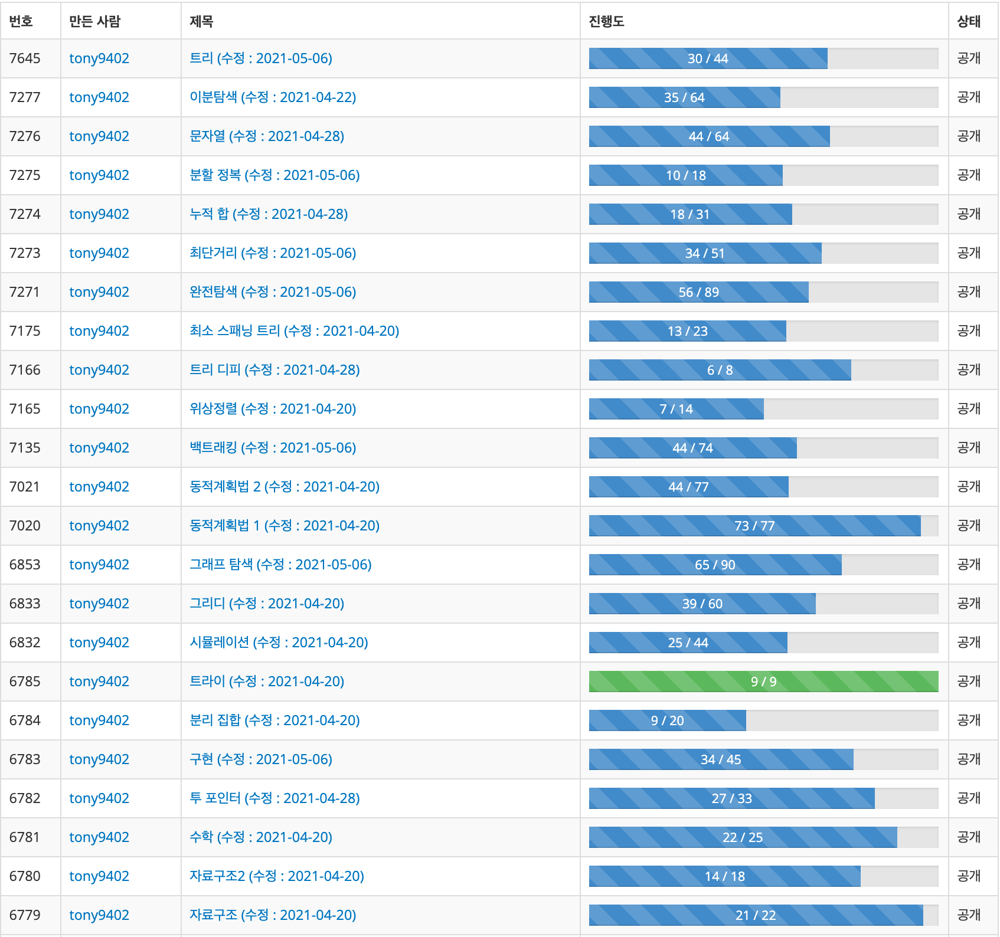

# 📕 문제 풀이 컨트리뷰트 가이드라인

**솔루션 PR은 [여기](https://github.com/tony9402/solutions_for_baekjoon_problems)로 옮겼습니다.**  
**가이드라인은 계속 업데이트 될 수 있습니다. 가이드라인이 업데이트 된 시점부터 한달동안 Issue에도 올리겠습니다.**

<!-- 1694 x 1588 (1.06675 : 1) -->
<p align="center">
  
  <p align="center">백준 문제집</p>
</p>

이미 푼 문제가 많지만 옛날에 푼 많지만 코드가 깔끔하지 않아 다시 새로 풀려고 합니다. 하지만 저 혼자 하기에는 너무 많은 시간이 필요하고 다른 일도 하는게 있어서 [BaaaaaaaarkingDog님이 하신거](https://github.com/encrypted-def/basic-algo-lecture/blob/master/solution-request.md)와 같이 집단 지성 프로젝트로 만들어보려 합니다.  

*아래 있는 규칙은 BaaaaaaaaaaarkingDog님이 작성하신걸 참고하여 적었습니다.*

## 📁 Repo 폴더 구조

각 알고리즘에 대한 문제 리스트는 ```해당 알고리즘 폴더```에서 볼 수 있습니다.  
예를 들어 Data Structure에 대한 문제 리스트는 [```data_structure```](https://github.com/tony9402/baekjoon/tree/main/data_structure)에서 볼 수 있습니다.  

풀이 코드가 있는 곳은 solution 폴더 안에 있습니다.   
예를 들어, data_structure에 있는 ```백준 1158번 요세푸스 문제```에 대한 솔루션은 [```solution/data_structure/1158```](https://github.com/tony9402/baekjoon/tree/main/solution/data_structure/1158) 에 있습니다. 해당 경로에 언어 별로 솔루션 파일이 있습니다.


## 💻 Contribute 에 대한 설명

[아래 기준](#rule)을 맞추어 여러분들의 Solution Code를 main branch로 Pull Request (PR) 해주시면 됩니다 !  
Pull Request에 대한 설명은 [여기](https://wayhome25.github.io/git/2017/07/08/git-first-pull-request-story/)에서 보시면 됩니다.

현재 이 Repo는 코딩테스트를 준비하시는 분들을 위해 만든거라 언어는 ```C, C++, Java, Python 3, Javascript(Node.js), Kotlin, Rust, Swift, Go``` 총 9가지 언어만 허용합니다. 각 언어에 대한 솔루션 파일명과 제출 언어(ex. C++17)는 아래만 허용합니다.

| Language | 파일명 및 확장자     | 백준 제출 언어          |
| :------- | :--------------- | :------------------- |
| C        | main.c           | [C2x](https://help.acmicpc.net/language/info#language-102), [C11](https://help.acmicpc.net/language/info#language-75)  |
| C++      | main.cpp         | [C++14](https://help.acmicpc.net/language/info#language-88), [C++17](https://help.acmicpc.net/language/info#language-84), [C++20](https://help.acmicpc.net/language/info#language-95)  |
| Python 3 | main.py          | [Python 3](https://help.acmicpc.net/language/info#language-28), [PyPy3](https://help.acmicpc.net/language/info#language-73)      |
| Java     | Main.java        | [Java 8](https://help.acmicpc.net/language/info#language-3), [Java 11](https://help.acmicpc.net/language/info#language-93), [Java 15](https://help.acmicpc.net/language/info#language-107)      |
| Kotlin   | main.kt          | [Kotlin (JVM)](https://help.acmicpc.net/language/info#language-69)         |
| Node.js  | main.js          | [node.js](https://help.acmicpc.net/language/info#language-17)              |
| Rust     | main.rs          | [Rust 2015](https://help.acmicpc.net/language/info#language-44), [Rust 2018](https://help.acmicpc.net/language/info#language-94), [Rust 2021](https://help.acmicpc.net/language/info#language-113) |
| Swift    | main.swift       | [Swift](https://help.acmicpc.net/language/info#language-74)                |
| Go       | main.go          | [Go](https://help.acmicpc.net/language/info#language-12)                   |

## Rule

### 필수 - 반드시 아래 규칙들을 지켜주세요. 위배되는 솔루션 코드가 있으시 Reject 됩니다.

**해당 규칙은 추가, 수정, 삭제가 될 수 있습니다.**

- Rule 0 : **(모든 언어 공통)표준입출력으로 풀어야 합니다.**
- Rule 1 : 다른 사람의 솔루션을 자신이 푼 것처럼 Pull Request (PR) 하시면 **절대❗️** 안됩니다.
- Rule 2 : 아래와 같이 솔루션 맨 위에 정보를 **반드시** 넣어주세요. (Authored By에는 백준 닉네임으로 넣어야 합니다.)

```cpp
// Authored by : tony9402
// Co-authored by : -
// Link : http://boj.kr/3ee3d9284f2e4fd7b92b2a22e17d02d6
```

- Rule 3 : Pull Request (PR) 하나 당 솔루션 하나만 있어야 합니다. 같은 문제여도 언어마다 다르게 PR을 보내야 합니다. 이는 관리의 편의성을 위해 적용합니다.
- Rule 4 : `Allow edits by maintainers` 옵션을 허용으로 둬야합니다.
- Rule 5 : 분류에 맞는 솔루션을 올려야 합니다.
- Rule 6 : 1 Tab == 4 space, 즉 들여쓰기는 반드시 공백문자 4개로 해야합니다.  

#### C++

- Rule 7 : 솔루션에는 `bits/stdc++.h` 헤더파일만 존재해야합니다. 다른 해더파일이 있으면 안됩니다.  
- Rule 8 : 입출력은 C++ stream을 이용해야 합니다. `ios::sync_with_stdio(false); cin.tie(nullptr);`이 main 함수 안에 맨 첫줄에 있어야 합니다. `endl` 대신 `'\n'`을 써야합니다.  
- Rule 9 : `#define, typedef`는 `typedef long long ll;` 또는 `#define ll long long`만 허용됩니다.  
- Rule 10 : 논리 연산자인 `and, or`인 경우는 반드시 `&&, ||` 로 사용해야 합니다.  
- Rule 11 : 반드시 실수 연산을 해야하는 경우는 `float`보단 `double`로 사용해주세요. 이 외에는 반드시 정수에서 연산을 해주세요.
- Rule 12 : `queue, priority_queue, stack, list` 등과 같은 자료구조는 STL을 이용해주세요.
- Rule 13 : 문자열은 반드시 `char*`대신 `string`을 이용해주세요. <!--*-->
- Rule 14 : `goto`문을 쓰지 말아주세요.
- Rule 15 : `class`보단 `struct`를 이용해주세요.

#### Python

- Rule 16 : 입력시 [해당 코드](http://boj.kr/e94b3c2e8dce4332b75806ff58c2981d) 처럼 input 함수를 만들어 입력을 받아야 합니다.

#### Java

- Rule 17 : [해당 코드](http://boj.kr/474912cdad044873b6aa14e34643f7b7) 처럼 FastReader Class를 이용해서 입력을 받아야 합니다.

### 권장 - 수정할 사항이 있으면 제가 직접 수정을 할 수 있습니다. 수정을 할 게 있다면 제 닉네임을 Co-Author에 추가합니다.

- Rule 18 : 변수와 함수의 이름은 어느 정도 의미하는 바를 드러내면서도 코드가 간결하도록 최대 10 글자 이내로 해주세요.  
  `hap`, `gop`, `gaesan`와 같은 변수명이나 함수명은 사용하지 말아주세요.
- Rule 19 : 한 줄짜리 `if, for, while` 문에는 중괄호를 쓰지 않는 것을 권장합니다.
- Rule 20 : 반복문 안에서 `if` 문에 조건이 많은 경우 `continue, break`를 활용해주세요.  

```cpp
// 이 코드보다 아래있는 코드처럼 작성하시는 걸 권장합니다.
for(int k=0;k<4;k++){
    int qy = y + dy[k];
    int qx = x + dx[k];
    if(0 <= qy && qy < n && 0 <= qx && qx < n) {
        if(Map[qy][qx] != '0') {
            Map[qy][qx] = '0';
            q.push(make_pair(qy, qx));
        }
    }
}

for(int k=0;k<4;k++){
    int qy = y + dy[k];
    int qx = x + dx[k];
    if(0 > qy || qy >= n || 0 > qx || qx >= n) continue;
    if(Map[qy][qx] == '0')continue;
    Map[qy][qx] = '0';
    q.push(make_pair(qy, qx));
}
```
- Rule 21 : 불필요한 연산이 없도록 최대한 정리를 해주세요.
- Rule 22 : 배열은 반드시 전역에 선언해주세요. 배열 사이즈는 엄청 타이트하게 잡지 말고 `+1 ~ +10` 정도로 넉넉하게 잡아주세요.
- Rule 23 : 소스코드 일부에 어떤 코드인지 간단한 주석처리를 해주시면 감사하겠습니다. 다른 분들이 보실 때 코드만 볼 경우 이해가 안되는 경우가 있습니다.
- Rule 24 : 어떤 방식으로 풀었는지 PR을 남기실 때 간단하게 자신의 풀이를 남겨주세요.
